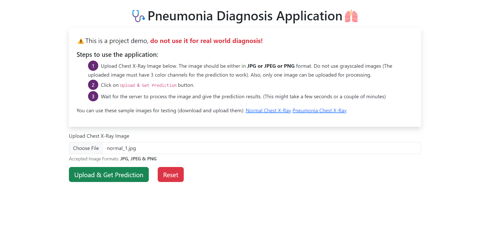
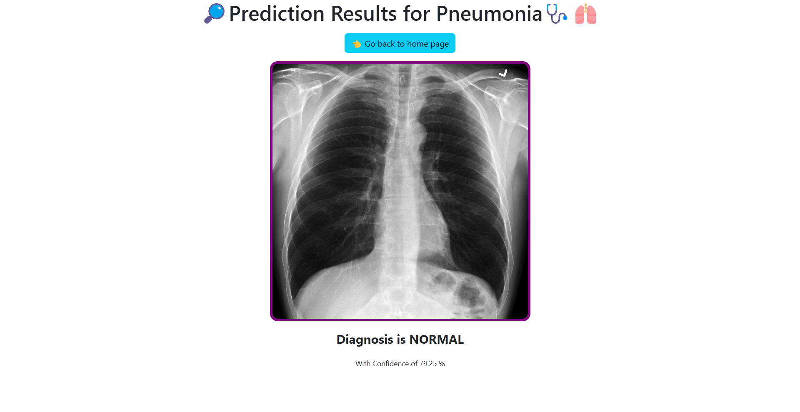
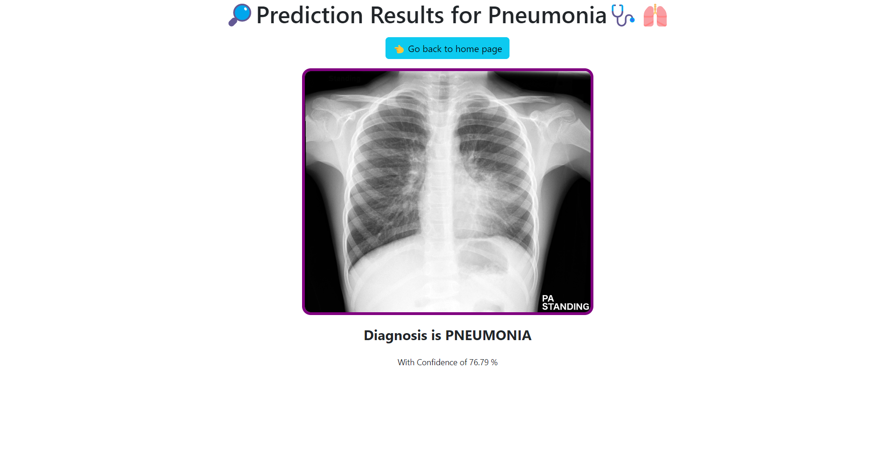
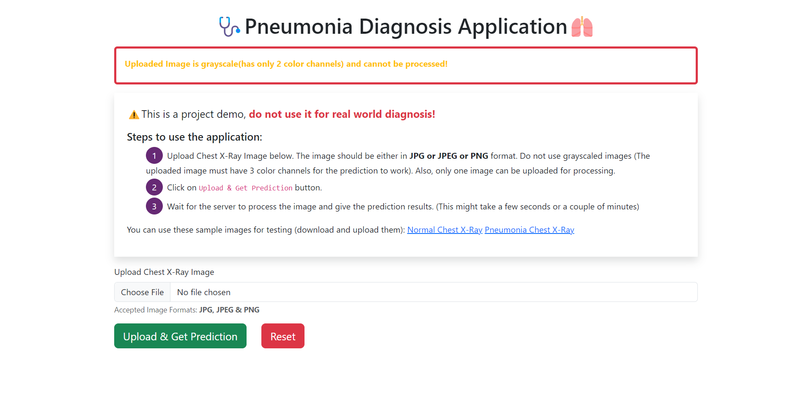

# 🩺Pneumonia Diagnosis from Chest X-Ray Images 

## Description of files in the repo

➡️ `app.py` - **Flask** Server

➡️ `Pneumonia_Diagnosis_From_Chest_X_Rays_Final.ipynb` - IPython Notebook containing the code used to train various TensorFlow models.

➡️ `predict_result.py` - Script used to load the saved model and perform inference for an input image.

➡️ `requirements.txt` - Contains the python dependencies & the associated versions.

➡️ `Summary.xlsx` - Excel file containing the metrics (such as train|val|test loss|accuracy, precision, recall, etc) for the 5 models that I have built

➡️ `static` and `templates` - Flask uses these folder to serve static files, store uploaded images & render HTML pages.

## Screenshots

#### Home Page:

#### Upload Normal Chest X-Ray image (before prediction):

#### Diagnosis Results for Normal Chest X-Ray:

#### Diagnosis Results for Pneumonia Chest X-Ray:

#### Error message for grayscale image:
(Some images which you download from the internet, or kaggle dataset are grayscale images and they do not contain 3 color channels. This model specifically required 3 color channels for inference.)

